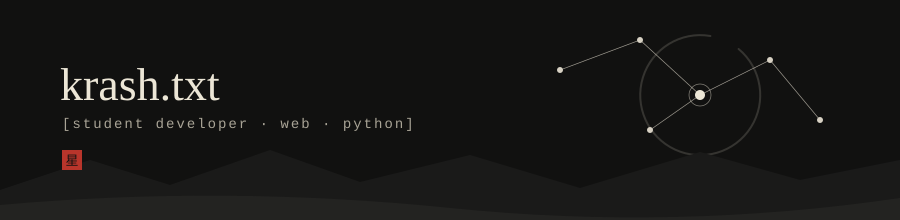

  

I build varieties of projects and I'm
learning backend,kubernetes.
I am aiming for a better understanding in everything and all stacks

---

## Works

| Project | What it is | Stack |
| :-- | :-- | :-- |
| [env-guardrail](https://github.com/krishpusa-prog/env-guardrail) | [A npm package to detect env leaks in your codebase] | TS |
| [ZenGarden](https://github.com/krishpusa-prog/ZenGarden) | [A pomodoro app for your mental peace] | HTML |
| [PixelPair](https://github.com/krishpusa-prog/PixelPair) | [A fast and safe similarity search application for local files]| JS |
| [Terminal Music Player](https://github.com/krishpusa-prog/TerminalApplication-AD-) | [Your local terminal spotify] | Python |

## Now

- Building: TraceNet
- Learning: Kubernetes
- Looking for: internships / collaborators / open source to contribute to

## Stack

`Python` `HTML` `CSS` `JavaScript` `Git` `ROS`

## Channels

[Portfolio](https://your-site.com) · [LinkedIn](www.linkedin.com/in/kaustubh-kashyap-23b690379)  · [Email](krishpusa@gmail.com)

星 · [2007]
